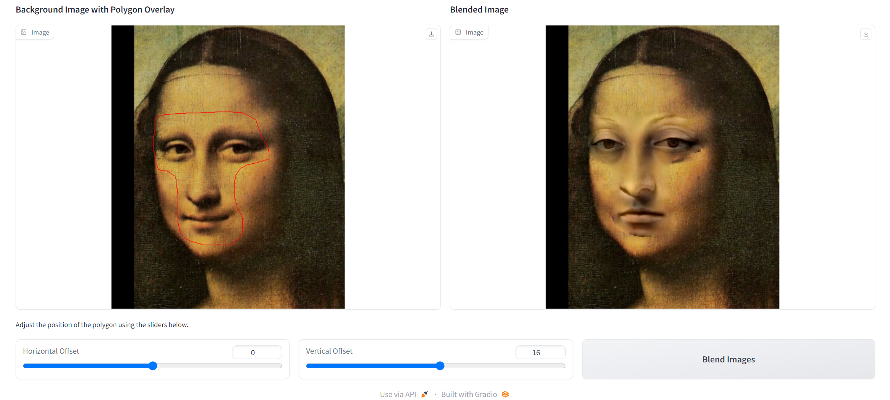

# Assignment 2 - DIP with PyTorch

### In this assignment, I have implemented traditional DIP (Poisson Image Editing) and deep learning-based DIP (Pix2Pix) with PyTorch.

### Resources:
- [Assignment Slides](https://rec.ustc.edu.cn/share/705bfa50-6e53-11ef-b955-bb76c0fede49)  
- [Paper: Poisson Image Editing](https://www.cs.jhu.edu/~misha/Fall07/Papers/Perez03.pdf)
- [Paper: Image-to-Image Translation with Conditional Adversarial Nets](https://phillipi.github.io/pix2pix/)
- [Paper: Fully Convolutional Networks for Semantic Segmentation](https://arxiv.org/abs/1411.4038)

---

## Implementation of Poisson Image Editing with PyTorch

使用laplacian kernel直接融合得到的结果在背景纹理信息上表现不佳，因此也尝试使用了混合梯度；同时发现相较于论文结果，部分区域过渡不自然，算法对mask要求高。

## Implementation of Pix2Pix with PyTorch
## Results (need add more result images)
### Basic Transformation

### Point Guided Deformation:

