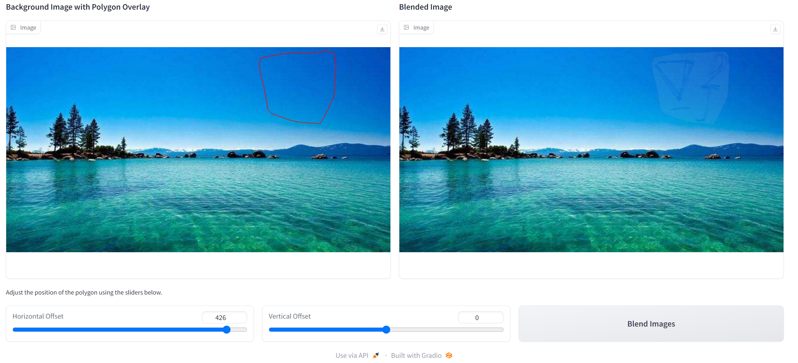
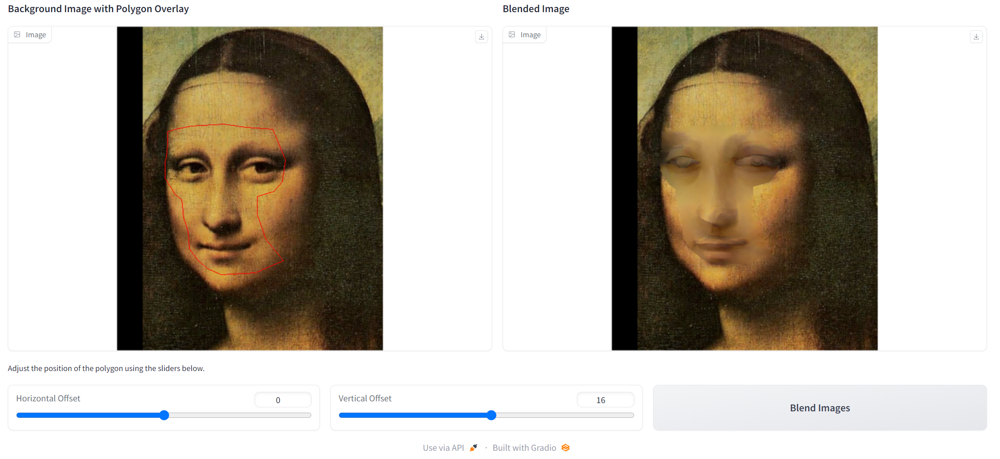
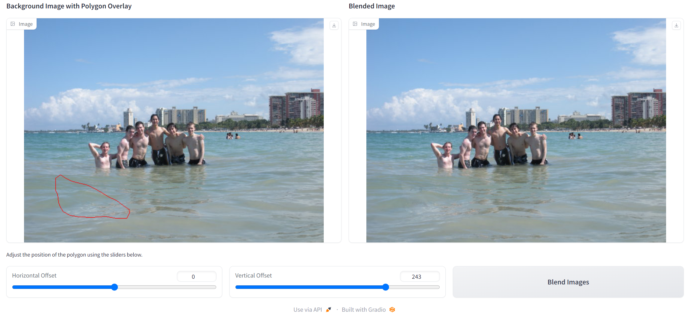
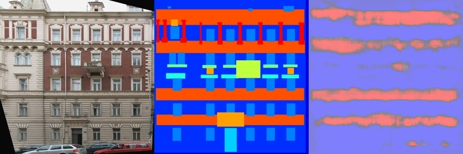
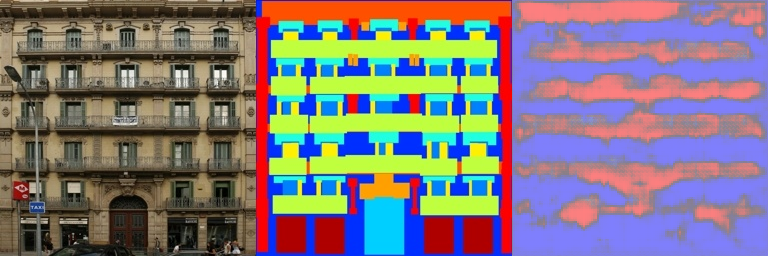
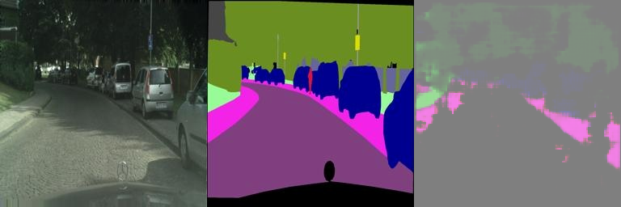
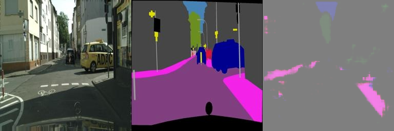

# Assignment 2 - DIP with PyTorch

### In this assignment, I have implemented traditional DIP (Poisson Image Editing) and deep learning-based DIP (Pix2Pix) with PyTorch.

### Resources:
- [Assignment Slides](https://rec.ustc.edu.cn/share/705bfa50-6e53-11ef-b955-bb76c0fede49)  
- [Paper: Poisson Image Editing](https://www.cs.jhu.edu/~misha/Fall07/Papers/Perez03.pdf)
- [Paper: Image-to-Image Translation with Conditional Adversarial Nets](https://phillipi.github.io/pix2pix/)
- [Paper: Fully Convolutional Networks for Semantic Segmentation](https://arxiv.org/abs/1411.4038)

---

## Implementation of Poisson Image Editing with PyTorch
使用laplacian kernel直接融合得到的结果在背景纹理信息上表现不佳，在Equation和Monolisa中可以明显观察到这种情况。因此尝试使用融合散度，计算source和target四个方向的梯度，取绝对值大的一方作为最终梯度。不过目前在Monolisa上没有实现出应该有的效果，待后续debug。
在实验中发现，对于source和target大小不一致的情况，需要进行填充；采用同样的代码warter跑出来的结果，source若隐若现，几乎看不到，猜测Mixing Gradients可能有助于改善这种情况。
### Equation

### Monolisa
#### Laplacian kernel

#### kernels for gradient computation in four directions

### Water

## Implementation of Pix2Pix with PyTorch
在小样本facades数据集上训练，后期loss几乎无法下降并且最后结果(Train loss:0.6045 Val Loss:0.6278)是较大样本cityscapes数据集结果(Train loss:0.3895 Val Loss:0.4034)的1.5倍左右。从最后结果上来看，继续增加训练Epoch可能提升效果有限，应该采用一个更大的网络结构。
### facades (400 images)
#### Train Results

#### Val Results

### cityscapes (2975 images)
#### Train Results

#### Val Results

