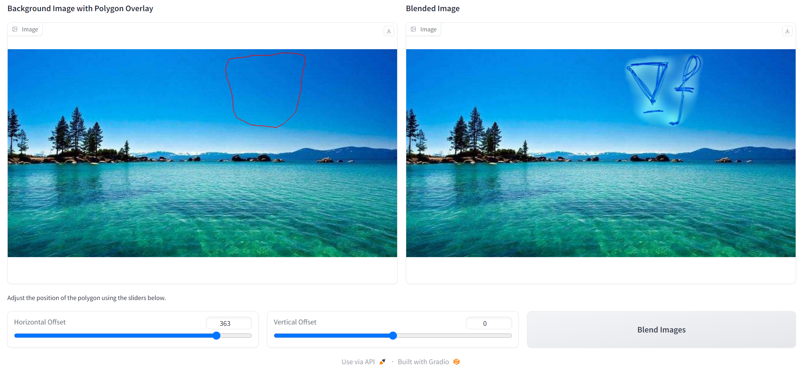
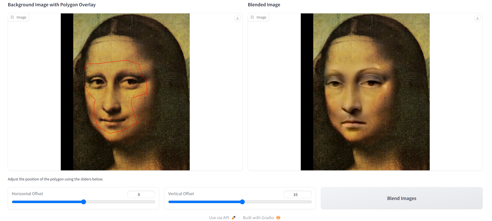
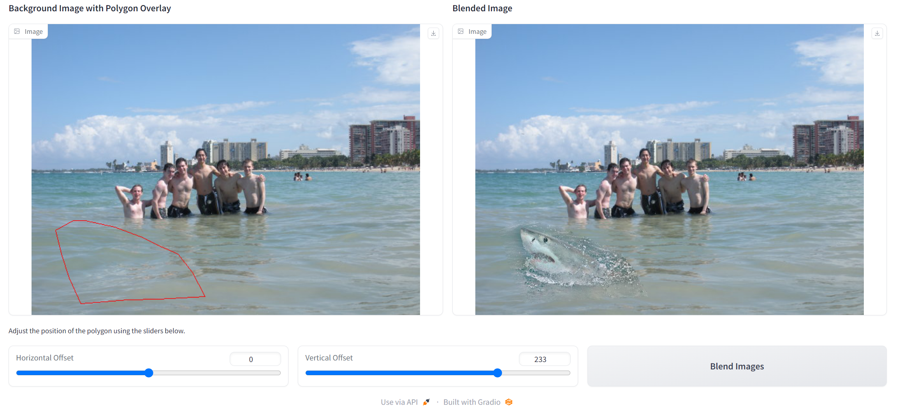
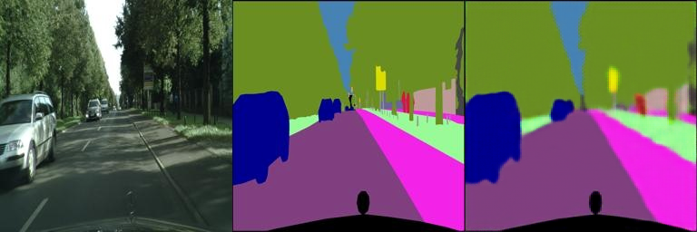

# Assignment 2 - DIP with PyTorch

### In this assignment, I have implemented traditional DIP (Poisson Image Editing) and deep learning-based DIP (Pix2Pix) with PyTorch.

### Resources:
- [Assignment Slides](https://rec.ustc.edu.cn/share/705bfa50-6e53-11ef-b955-bb76c0fede49)  
- [Paper: Poisson Image Editing](https://www.cs.jhu.edu/~misha/Fall07/Papers/Perez03.pdf)
- [Paper: Image-to-Image Translation with Conditional Adversarial Nets](https://phillipi.github.io/pix2pix/)
- [Paper: Fully Convolutional Networks for Semantic Segmentation](https://arxiv.org/abs/1411.4038)

---

## Implementation of Poisson Image Editing with PyTorch

Fill the [Polygon to Mask function](run_blending_gradio.py#L102) and the [Laplacian Distance Computation](run_blending_gradio.py#L146) of 'run_blending_gradio.py'.

使用laplacian kernel直接融合得到的结果在背景纹理信息上表现不佳，在Equation和Monolisa中可以明显观察到这种情况。因此尝试使用融合散度，计算source和target四个方向的梯度，取绝对值大的一方作为最终梯度。不过目前在Monolisa上没有实现出应该有的效果，待后续debug。
### Equation

### Monolisa
#### Laplacian kernel

#### kernels for gradient computation in four directions

### Water

## Implementation of Pix2Pix with PyTorch

Fill the [Fully Convolutional Network](Pix2Pix/FCN_network.py#L14) of 'FCN_network.py'.

1、首先尝试在小网络上进行训练，最终效果较差，facades数据集训练中后期loss几乎无法下降；
2、在更大的网络结构上两个数据集都得到了更好的效果，facades数据集泛化能力差(Train loss:0.0675 Val Loss:0.3776)，cityscapes数据集(Train loss:0.0394 Val Loss:0.1172)在训练集、验证集上都具有更好的表现。
### facades (400 images)
#### Train Results

#### Val Results

### cityscapes (2975 images)
#### Train Results

#### Val Results

