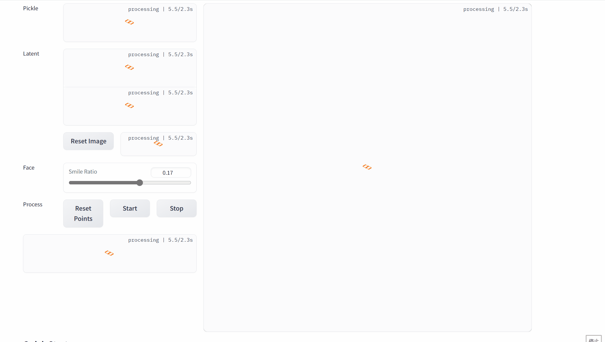

# Assignment 3 - Play with GANs

### In this assignment, I have implemented implement two methods for using GANs in digital image processing.

### Resources:
- [Paper: Image-to-Image Translation with Conditional Adversarial Nets](https://phillipi.github.io/pix2pix/)
- [DragGAN](https://vcai.mpi-inf.mpg.de/projects/DragGAN/): [Implementaion 1](https://github.com/XingangPan/DragGAN)
- [Facial Landmarks Detection](https://github.com/1adrianb/face-alignment)

---

## Implementation of Pix2Pix with PyTorch

Add [Class Discriminator](Pix2Pix/FCN_network.py) of 'FCN_network.py'.  
Adjust the training loss function by applying a [discriminator loss](Pix2Pix/train.py) of 'train.py'.  

1、原文提到判别器中使用1&times;70&times;70是比较好的，所以复现代码选择了1&times;64&times;64，L1 loss权重参考原文选择lambda=100（同时参考老师课程资料，本次实现将真实图片设为输出值）；  
2、目前网络基于Assignment 2中给出的pytorch框架实现，部分细节区别于原文github链接中基于tensorflow的实现，最终结果也有差异。

### cityscapes (2975 images)
#### Train Results


#### Val Results


## Implementation of combinating DragGAN with automatic face landmarks

### DragGAN
#### Download

```setup
git clone https://github.com/XingangPan/DragGAN
```

#### Requirements

```setup
conda env create -f environment.yml
pip install -r requirements.txt
```

#### Download pre-trained StyleGAN2 weights

```setup
wget https://api.ngc.nvidia.com/v2/models/nvidia/research/stylegan2/versions/1/files/stylegan2-ffhq-512x512.pkl
```
or

```setup
python scripts/download_model.py
```

### Face Alignment
#### Download

```setup
git clone https://github.com/1adrianb/face-alignment
```

#### Requirements

```setup
pip install -r requirements.txt
```

#### Install

```setup
python3 setup.py install
```

### Implementation
Modify based on ['visualizer_drag_gradio.py'](Draggan/visualizer_drag_gradio.py).  

```setup
python3 visualizer_drag_gradio.py
```

### Results
#### Face Slimming


#### Smile


#### Enlarge the eyes


#### Close the eyes

